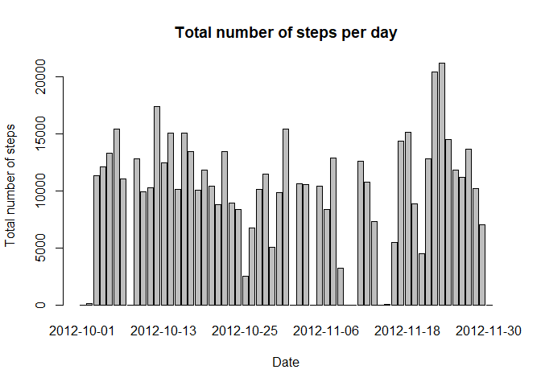
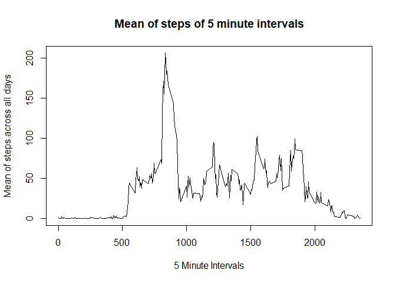
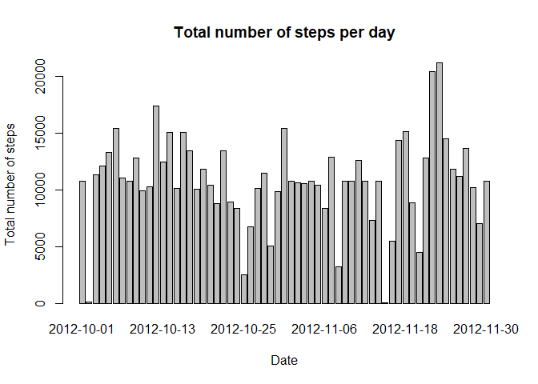
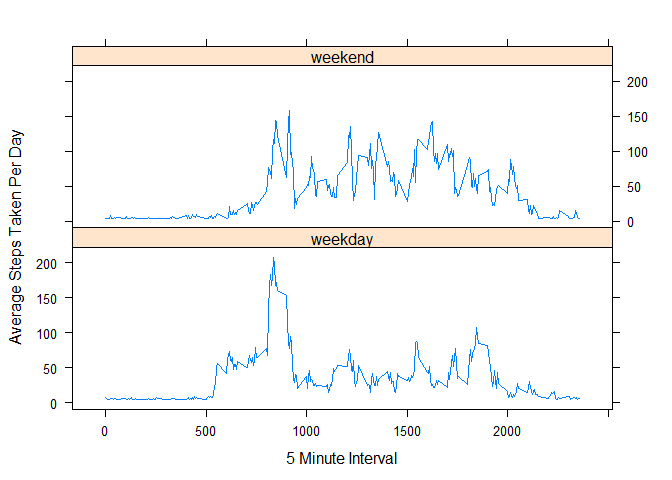

# Reproducible Research: Peer Assessment 1
Wilson  
August 13, 2017  


## Loading and preprocessing the data

Load the data into R, format the date and take a sneak peek at the data to confirm it loaded correctly.


```r
data <- read.table(unz("activity.zip", "activity.csv"), header=T, quote="\"", sep=",")
data$date <- as.Date(data$date)
head(data)
```

```
##   steps       date interval
## 1    NA 2012-10-01        0
## 2    NA 2012-10-01        5
## 3    NA 2012-10-01       10
## 4    NA 2012-10-01       15
## 5    NA 2012-10-01       20
## 6    NA 2012-10-01       25
```

## What is mean total number of steps taken per day?

Plot a histogram of total number of steps per day.

```r
sumPerDay <- sapply(split(data$steps, data$date), sum, na.rm=TRUE)
barplot(sumPerDay,names.arg=names(sumPerDay),xlab="Date",
        ylab="Total number of steps",main="Total number of steps per day")
```

<!-- -->

Output the mean of total number of steps per day.


```r
mean(sumPerDay)
```

```
## [1] 9354.23
```

Output the median of total number of steps per day.


```r
median(sumPerDay)
```

```
## [1] 10395
```


## What is the average daily activity pattern?

Get the mean of steps per interval across all days.


```r
meanStepsInterval <- sapply(split(data$steps, data$interval), mean, na.rm=TRUE)
intervals <- levels(as.factor(data$interval))
plot(intervals, meanStepsInterval, type="l", xlab="5 Minute Intervals", 
     ylab="Mean of steps across all days", main="Mean of steps of 5 minute intervals")
```

<!-- -->

Get maximum mean of interval


```r
maxIndex <- which.max(meanStepsInterval)
maxMeanInt <- as.numeric(intervals[maxIndex])
maxMeanInt
```

```
## [1] 835
```


```r
stepmedian <- sapply(split(data$steps, data$date), median, na.rm=TRUE)
stepmedian
```

```
## 2012-10-01 2012-10-02 2012-10-03 2012-10-04 2012-10-05 2012-10-06 
##         NA          0          0          0          0          0 
## 2012-10-07 2012-10-08 2012-10-09 2012-10-10 2012-10-11 2012-10-12 
##          0         NA          0          0          0          0 
## 2012-10-13 2012-10-14 2012-10-15 2012-10-16 2012-10-17 2012-10-18 
##          0          0          0          0          0          0 
## 2012-10-19 2012-10-20 2012-10-21 2012-10-22 2012-10-23 2012-10-24 
##          0          0          0          0          0          0 
## 2012-10-25 2012-10-26 2012-10-27 2012-10-28 2012-10-29 2012-10-30 
##          0          0          0          0          0          0 
## 2012-10-31 2012-11-01 2012-11-02 2012-11-03 2012-11-04 2012-11-05 
##          0         NA          0          0         NA          0 
## 2012-11-06 2012-11-07 2012-11-08 2012-11-09 2012-11-10 2012-11-11 
##          0          0          0         NA         NA          0 
## 2012-11-12 2012-11-13 2012-11-14 2012-11-15 2012-11-16 2012-11-17 
##          0          0         NA          0          0          0 
## 2012-11-18 2012-11-19 2012-11-20 2012-11-21 2012-11-22 2012-11-23 
##          0          0          0          0          0          0 
## 2012-11-24 2012-11-25 2012-11-26 2012-11-27 2012-11-28 2012-11-29 
##          0          0          0          0          0          0 
## 2012-11-30 
##         NA
```

## Imputing missing values

Check how many rows are NA.


```r
length(which(is.na(data)))
```

```
## [1] 2304
```

The NA's will be replaced by the mean of steps column.

Duplicate the data set into newData.


```r
newData <- data
newData$steps[which(is.na(newData$steps))] <- mean(newData$steps,na.rm=TRUE)
head(newData)
```

```
##     steps       date interval
## 1 37.3826 2012-10-01        0
## 2 37.3826 2012-10-01        5
## 3 37.3826 2012-10-01       10
## 4 37.3826 2012-10-01       15
## 5 37.3826 2012-10-01       20
## 6 37.3826 2012-10-01       25
```

Plot a histogram of total number of steps per day for the new data set.

```r
sumPerDay2 <- sapply(split(newData$steps, newData$date), sum, na.rm=TRUE)
barplot(sumPerDay2,names.arg=names(sumPerDay2),xlab="Date",
        ylab="Total number of steps",main="Total number of steps per day")
```

<!-- -->

Output the mean of total number of steps per day.


```r
mean(sumPerDay2)
```

```
## [1] 10766.19
```

Output the median of total number of steps per day.


```r
median(sumPerDay2)
```

```
## [1] 10766.19
```

Yes. It differs from the estimations of the first plot. The data leaned more towards the average of the total data set.


## Are there differences in activity patterns between weekdays and weekends?

Add a new column labelling weekday or weekend


```r
newData$day <- ifelse(weekdays(newData$date,TRUE) %in% c("Sat", "Sun"), "weekend", "weekday")
newData$day <- as.factor(newData$day)
meanStepsDay <- aggregate(steps ~ interval + day, data = newData, mean)
names(meanStepsDay) <- c("interval", "day", "steps")
```

Plot the data out using lattice plot.


```r
library(lattice)
xyplot(steps ~ interval | day,data=meanStepsDay, type = 'l', layout = c(1, 2),
       xlab="5 Minute Interval", ylab="Average Steps Taken Per Day")
```

<!-- -->
